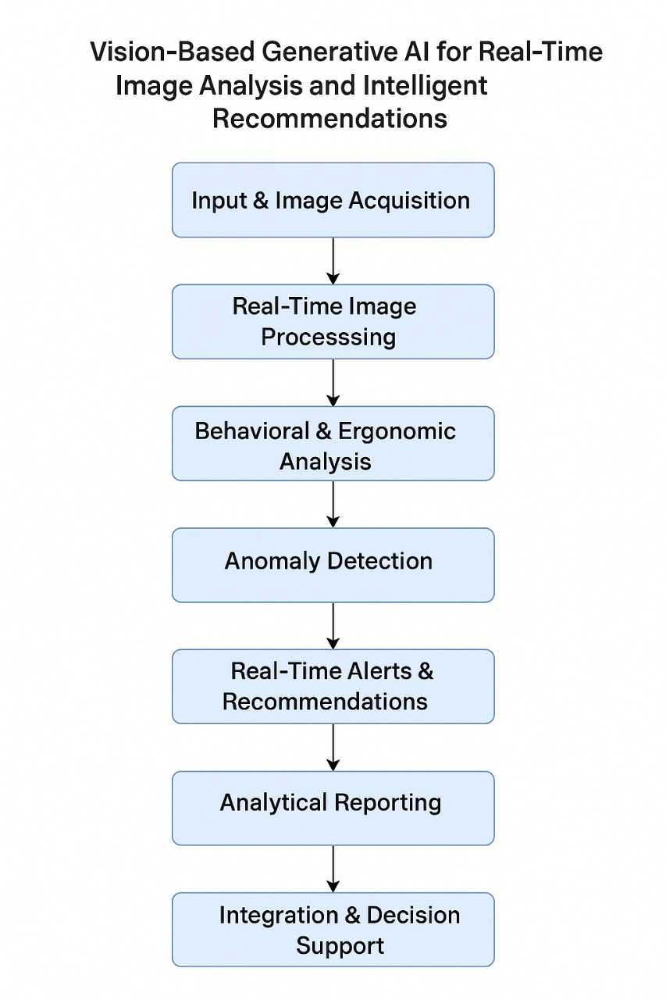

# Vision-Based Generative AI for Real-Time Image Analysis and Intelligent Recommendations

## Private Sector Project 01 – Large Pharmaceutical Manufacturer  
**Research Domain**: Generative AI | Computer Vision | Industrial Automation | Human Ergonomics  
**Research Lead**: FAAIR (Foundation for Advanced AI and Research)

---

## Objective

To develop a vision-based generative AI system capable of real-time image analysis and intelligent recommendations, focused on safety, compliance, and process optimization in high-precision industrial environments such as pharmaceutical clean rooms.

---

## Key Goals

- Monitor operator behavior using ergonomic analysis for adherence to safety and regulatory standards.
- Detect anomalies (e.g., smoke or particulate presence) in clean rooms through image recognition.
- Generate real-time alerts and intelligent recommendations.
- Improve operational efficiency, safety, and regulatory compliance.
- Integrate AI-powered decision-making into existing industrial surveillance workflows.

---

## System Architecture

The proposed solution integrates the following modules:

1. **Data Ingestion**: Real-time video feed from clean rooms.
2. **Pose Estimation**: Detect human posture and ergonomics.
3. **Anomaly Detection**: Identify visual disturbances like smoke.
4. **Generative Inference**: Suggest actions or alerts based on detected behaviors or anomalies.
5. **Reporting Module**: Generate logs, alerts, and compliance reports in real-time.

*A detailed block diagram is available in the `diagrams/` folder.*
---

## Datasets Collected

> All datasets will be uploaded under the `data/` directory.

- **FAAIR Clean Room Surveillance Dataset**  
  Captured from industry-approved simulation environments adhering to ethical and privacy standards.

- **Human Ergonomic Dataset (OpenPose-Compatible)**  
  Used for training human pose estimation models.

- **Smoke Anomaly Footage**  
  Generated and collected from public datasets and synthetic visual environments.

---

## Algorithms and Tools Used

- **Pose Estimation**: OpenPose, BlazePose, MediaPipe
- **Object & Anomaly Detection**: YOLOv8, CNN-LSTM hybrids
- **Generative Recommendation**: Vision Transformers (ViT), Diffusion Models
- **Data Processing**: OpenCV, FFmpeg
- **Backend Deployment**: TorchServe, FastAPI (planned)
- **Explainability**: Grad-CAM for interpretability of model outputs

---

## Project Milestones

| Milestone                          | Status         |
|-----------------------------------|----------------|
| Problem Statement & Scope Defined | ✅ Completed    |
| Dataset Collection                | ✅ Completed    |
| Initial Model Prototyping         | 🔄 In Progress  |
| Integration with Reporting Engine | 🔜 Upcoming     |
| Industry Simulation Testing       | ⏳ Scheduled    |

---

## License

This repository is published under the [MIT License](LICENSE).  
Usage of datasets may be subject to NDA if marked confidential.

---

## Collaboration & Contact

For collaboration inquiries, please contact:  
📧 research@faair.org  

---

## About FAAIR

The **Foundation for Advanced AI and Research (FAAIR)** is a DeepTech R&D organization advancing neural engineering and brain-inspired computing to address India's critical socio-economic challenges. Our AI solutions are aligned with the UN SDGs and Vision India 2035, focused on ethical, inclusive, and scalable innovation across sectors.

---

